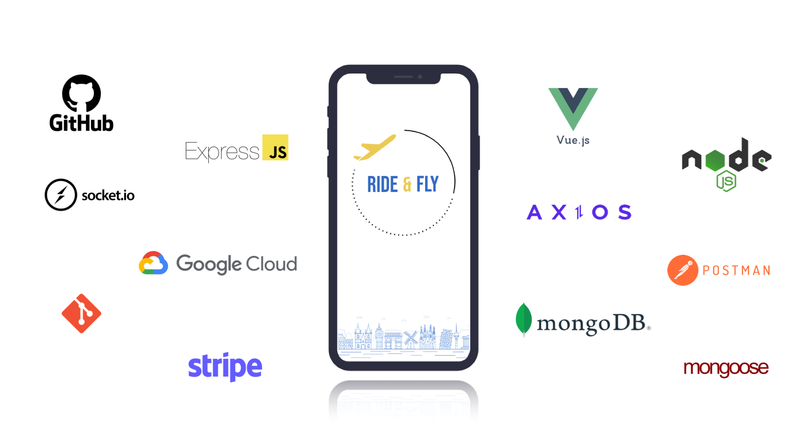

Ride & Fly is a full-stack carpool app developed as an external service for Ryanair, designed to benefit both the company and its passengers. The app helps travelers reach early morning flights safely and affordably while enabling Ryanair to increase passenger numbers on flights that are typically less occupied.

Developed over two semesters, the project involved the full product development process, including research, UX research, design, prototyping, and programming. As a full-stack application, Ride & Fly provides users with features such as viewing available rides, checking ride details, booking a ride, and communicating with drivers through an integrated chat feature.

