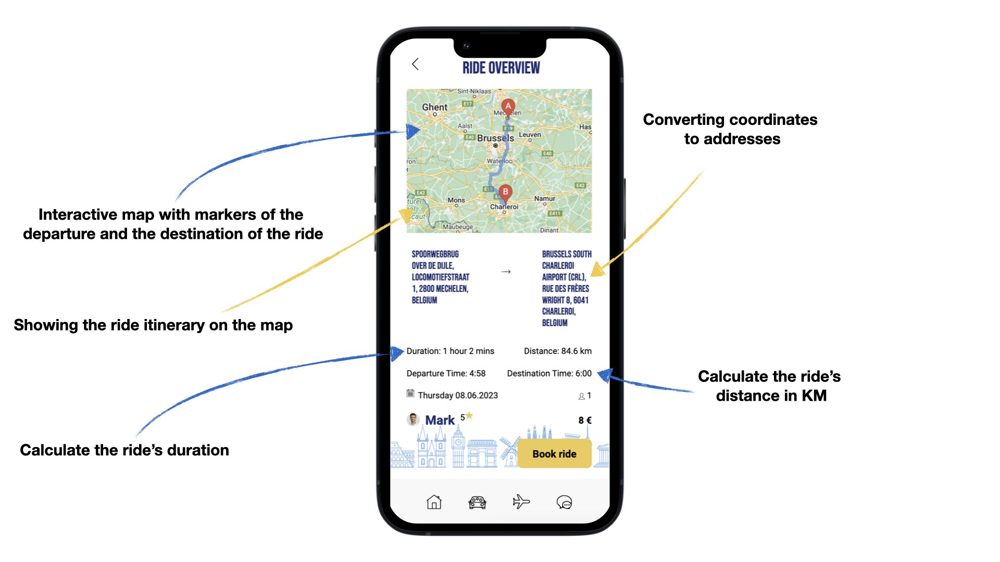

# 🚗 Ride & Fly – A Carpool App for Ryanair  

**Ride & Fly** is a full-stack carpool application developed as an external service for **Ryanair**, designed to benefit both the company and its passengers. The app helps travelers reach early morning flights **safely** and **affordably**, while also enabling Ryanair to increase passenger numbers on flights that are typically less occupied.  

## ✈️ Project Overview  

Developed over **two semesters**, this project followed the **full product development lifecycle**, including:  

✅ **Research & UX Research**  
✅ **UI/UX Design & Prototyping**  
✅ **Frontend & Backend Development**  

As a **full-stack application**, Ride & Fly provides users with features such as:  

✔️ **Viewing Available Rides**  
✔️ **Checking Ride Details**  
✔️ **Booking a Ride**  
✔️ **Communicating with Drivers (Integrated Chat Feature)**  

[Ride booking demo](https://files.catbox.moe/gzpjjx.mp4)
[Chat demo](https://files.catbox.moe/q80115.mp4)

